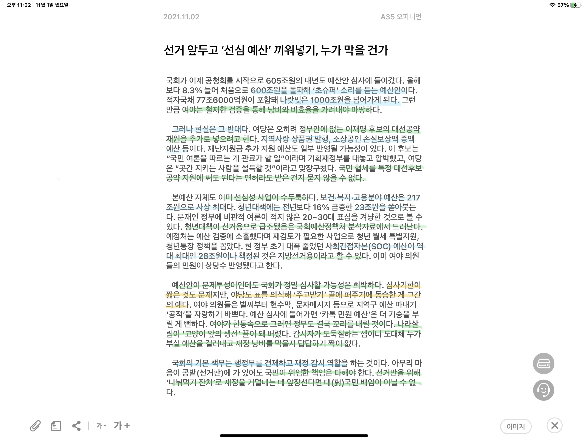

사실 : 

내년도 예산안은 사상 처음으로 600조원을 돌파했다. 이로써 나라빚은 1000조원을 넘어가게 된다.
예산안에는 지역사랑 상품권 발행, 소상공인 손실보상액 증액, 청년대책에 23조원, 사회간접자본(Social Overhead Captial) 28조원 등이 포함된다. 
국회의 기본 책무는 행정부를 견재하고, 재정 감시 역할을 하는 것이다.

 

의견 :
초슈퍼 예산안을 어떻게 사용할지, 철저한 검증을 통해 낭비와 비효율을 가려내야 한다. 
그러나 실상은 이재명 후보의 대선공약재원을 추가로 예산안에 편성하려는 것 같다.
국민 혈세를 특정 후보 공약 지원에 써도 된다는 말인가?

본예산 자체도 문제이다. 보건 복지 고용 분야에 217조원이 편성되어 있는데, 이는 2030의 표심을 겨냥한 선심성 사업이다.

예산안이 문제투성이임에도 불구하고, 국회가 이를 정밀 심사할 가능성은 희박하다
두가지 근거로 1. 심사 기한이 매우 짧다. 2. 여당뿐아니라 야당 또한 표를 의식한 끝에 퍼주기에 동승했다.

여야가 한통속으로 그러니 나라살림이 고양이 앞의 생선 꼴이 돼 버렸다. 재정을 감시한 국회에서 국가 재정을 도둑질하고 있으니, 누가 부실 예산을 걸러내고, 누가 재정 낭비를 막을지 답답하다. 

선거판이 중요하다 한들 국민이 위임한 책임은 다해야 한다. 