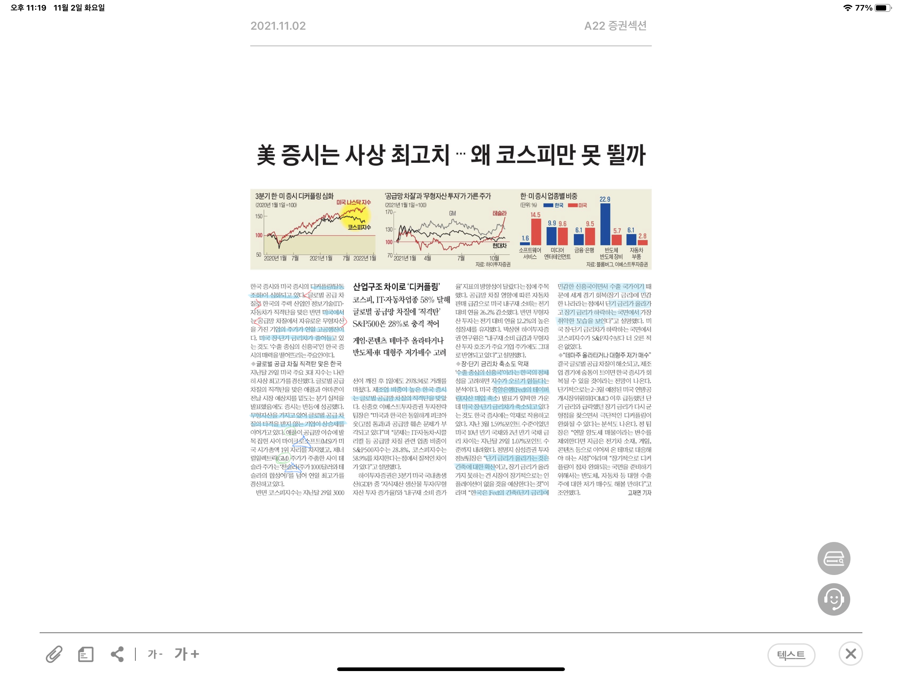

박스피 이유 
1. 글로벌 공급망 차질로 무형자산을 가진 기업의 주가는 오르는 반면(MS, TESLA), 애플이나 아마존 같은 기업은 예상치를 밑도는 분기실적을 발표했다.
그런데 코스피는 IT, 자동차 등 공급망 관련 업종 비중이 약 60퍼센트 정도 차지한다.

2. 장단기 금리차 축소도 악재이다. 미국 중앙은행에서 테이퍼링(긴축재정 - 자산 매입 축소) 발표가 임박한 가운데, 미국의 단기 금리는 급등하고 장기 금리는 하락하고 있다.(단기금리의 급등은 긴축에 대한 확인, 장기금리의 급락은 인플레이션이 없을 것이라는 예상) 우리나라는 수출 중심 국가이므로 세계 경기와 관련한 장기금리가 상승해야 유리한데, 현재는 이와 반대의 국면이므로 지수가 오르기 힘든 상황

테이퍼링? 국가가 채권 매입을 지속하면서 이자율을 낮추고 시장에 돈을 공급했다. 그런데 그 결과로 인플레이션 우려가 커지니까 긴축재정을 준비하는 것(양적 완화의 축소). 테이퍼링은 자연스럽게 금리의 상승을 이끈다. 미국 금리가 오르면? 사람들이 우리나라 돈을 미국 금융자산에 투자할 것이고 이는 외화의 유출로 이어져 원/달러 환율이 상승하게 될 것이다. 

그럼 환율 상승은 우리나라 기업의 수출에 좋은 것이지 않나? 일반적으로 그러하다. 그러나 구조적으로 우리나의 수입 비중이 점차 늘어나고 있으며, 특히 원자재 가격이 오르기 때문에, 올해와 같이 글로벌 공급망에 차질이 있는 경우 환율 상승이 큰 타격이 될수 있다. 또한 테이퍼링을 통해 달러의 유동성이 줄어들면 경제 침체가 발생할 가능성이 높고 우리나라 경제에도 타격이 클 것이다.  