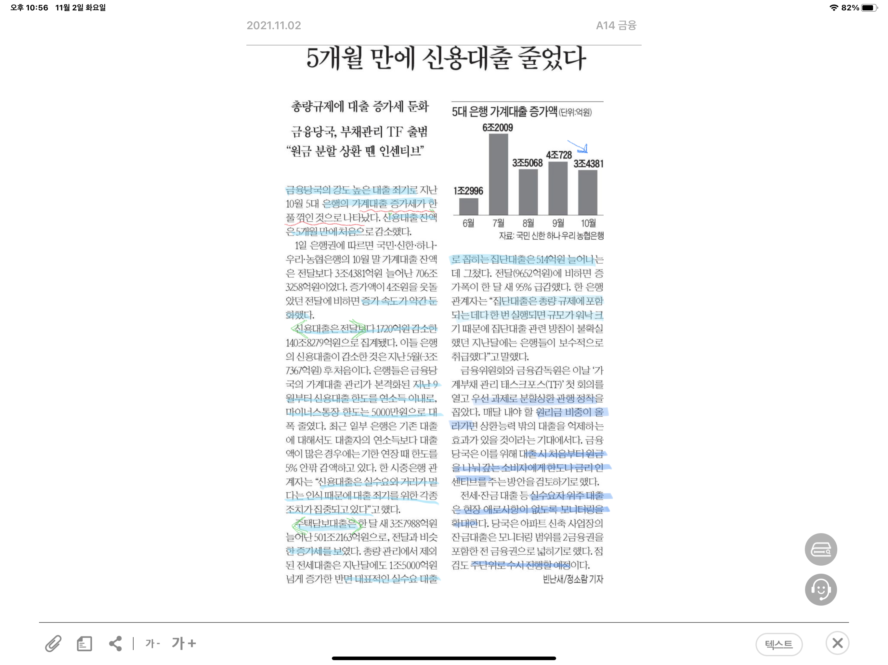

5개월 만에 신용대출 줄었다.

금융당국의 강도 높은 대출죄기로 은행의 가계대출 증가세가 한풀 꺾인 것으로 나타났다.

세부적으로는 우선 신용대출 증가액이 전달 대비 약 1조원 가량 감소했다. 이는 지난 9월부터 신용대출 한도를 연소득 이내로 제한하고, 마통 한도의 경우 5000 만원으로 제한한 결과이다. 다음으로 주택담보대출과 전세대출은 각각 3조, 1조 가량 증가했다. 반면 실수요대출인 집단대출은 500억 가량 증가하는것에 그쳤는데 이는 은행의 보수적 접근때문에 기인한 결과인 듯 하다. 금융위와 금융감독원은 우선 과제로 분할상환 관행정착을 꼽았다. 매달 내는 원리금 비중이 높을 수록 대출을 억제하는 효과가 커질 것으로 기대하기 때문이다. 이를 위해 대출 시 처음부터 원금을 나눠갚는 소비자에게 한도나 금리 인센티브를 주는 방안을 검토하기로 했다. 또한 실수요자 위주의 대출에는 애로사항이 없도록 모니터링을 확대하며 점검도 주 단위로 실시할 예정이다.