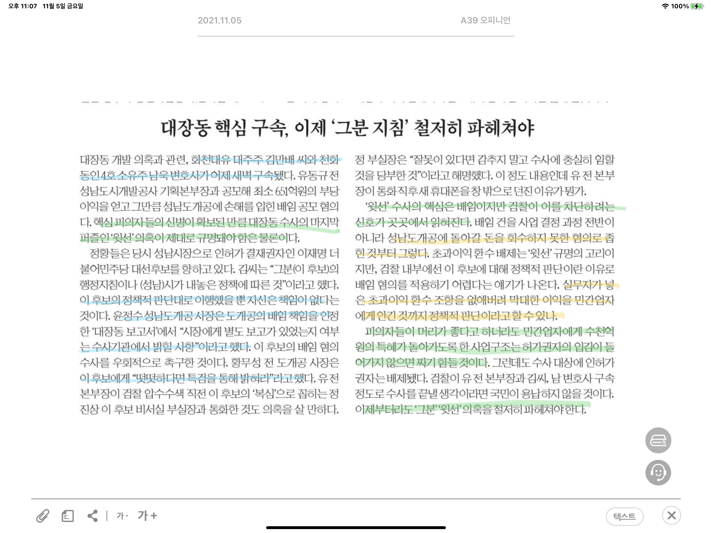
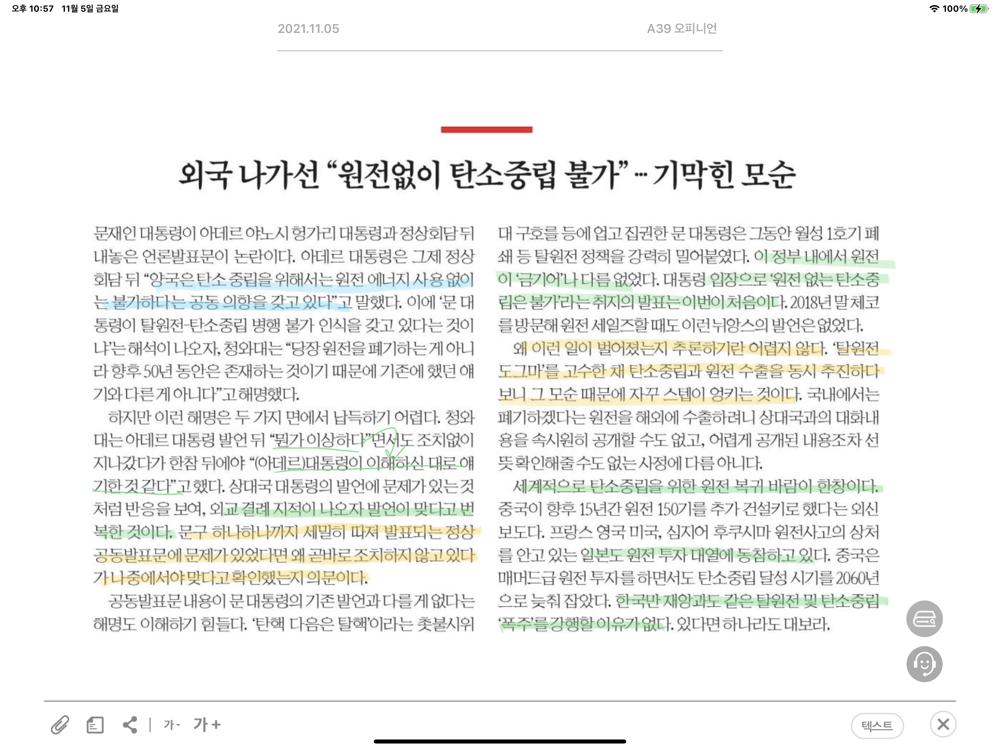

아데르 대통령은 정상회담 뒤 정상 공동발표문에서 "양국은 탄소 중립을 위해서는 원전 에너지 사용 없이는 불가하다는 공동의향을 갖고 있다" 라고 말했다. 이에 대해 문 대통령은 '기존 이야기와 다른 것이 아니다'라며 해명했는데 이에 대해 두 가지 측면에서 이해되지 않는 점이 있다.

첫 번째는 외교 결레를 의식해서 입장을 번복한 것이다. 통상적으로 공동성명발표문은 문구 하나하나까지 따져 발표되는데, 만약 문제가 있다면 초기에 조치하지 아니하고,뒤늦게서 재확인하는 입장을 밝히는가

두 번째는 공동발표문의 내용이 기존의 발언과 다를 바 없다고 하는 것이다. 이 정부 내에서 원전은 금기어나 다름 없었다. 그런데 '원전 없는 탄소중립은 불가'라니.  

이런 일이 발생하게 된 원인은 쉽게 추론이 가능하다. '탈원전 도그마'를 고수한 채, 탄소중립과 원전 수출을 동시에 추진하다보니 스탭이 꼬인 것이다. 

세계적으로 탄소중립을 위한 원전 복귀 바람이 한창이다. 심지어 후쿠시마 원전사고의 상처를 안고 있는 일본 또한 원전 투자 대열에 동참하고 있다.
한국만 재앙과 같은 탈원전 및 탄소중립 폭주를 강행할 이유가 없다.

