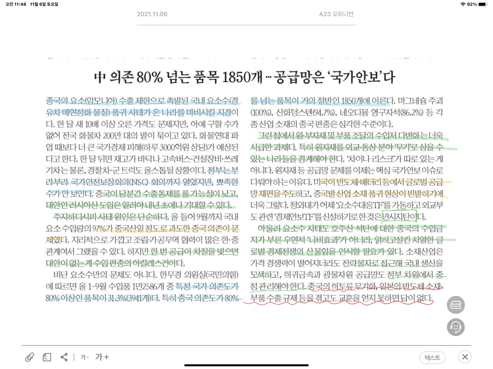

만시지탄 : 시기에 늦었음을 안타까워하는 탄식

호주산 석탄 수입금지와 요소수와의 관계 : 호주가 코로나 발생등을 중국의 책임으로 돌리자, 중국은 이에 대한 보복 조치로 호주산 석탄 수입 제한 조치를 발동했다. 중국은 호주로부터 석탄 소비량의 50% 가량을 수입하고 있었기 때문에 이는 곧 중국의 석탄 수급 대란으로 이어졌다. 요즘 이슈화 되고 있는 요소수 부족 문제는 이와 큰 관련이 있다고 볼 수 있다. 요소수는 석탄에서 암모니아를 추출해서 만들어지는데, 중국에서 석탄 수급의 문제로 요소 및 화학비료 수출을 억제하고 나선 것이다.

특히 암모니아는 화학비료를 만드는 원료이므로, 현재 곡물가격의 상승을 더욱 부추길 것으로 예상된다.